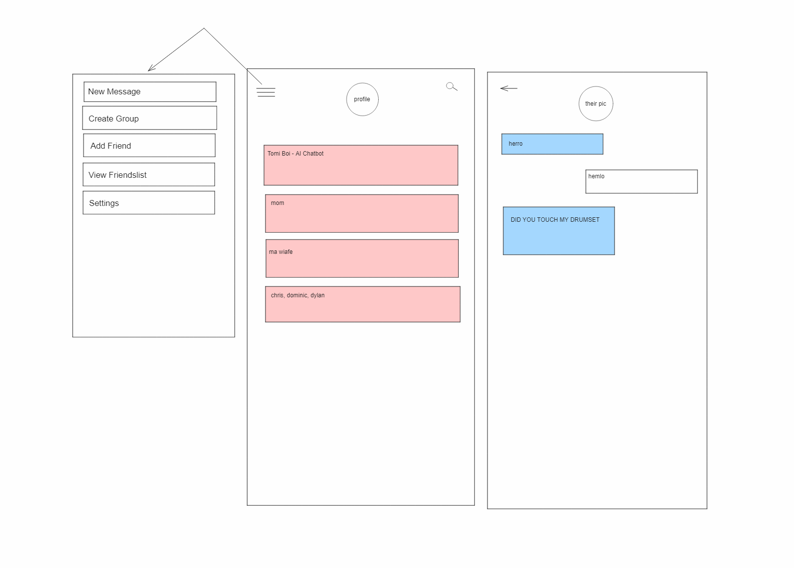

# Convo

## Project Contributors 

- Chris Davis
- Dylan Coito
- Dominic Keeps
- Mikey Whipple

## Project Description

Convo is a messaging platform that allows users to communicate with their friends via personal direct messages. This instant messenger allows users to easily search and add their friends. Then you will easily be able to chat with your friends and have exciting full conversations!

## Functions of Convo
- As a user, when you access the home page
- You will be prompted to either log in, or create a new user,
- When creating a new user, you will need to submit a username, valid email, and at minimum an 8 character password,
- Afer you create a user or log in, you will find yourself on the home page, to get started you will need to click search on the top left
- When search is clicked, you will be prompted to input your friends email,
- If their email is valid, a card will be generated containing their user name and email and an Add friend button.
- Once a friend is added you can return to your homepage and a new card with your friends name will be generated.
- The card will contain your friends user name and a button called Chat Now!
- By clicking on Chat Now! You will be redirected to your individual chat forum with your friend.
- From there you will be able to write and submit messages which will be recieved by your friend and vise versa!
- Now your messages will be stored and recalled whenever you access that friends chat!

## Technologies Implemented
- bcrypt
- express
- mysql2
- sequelize
- Socket.io
- Databases and through table

## Wireframe

